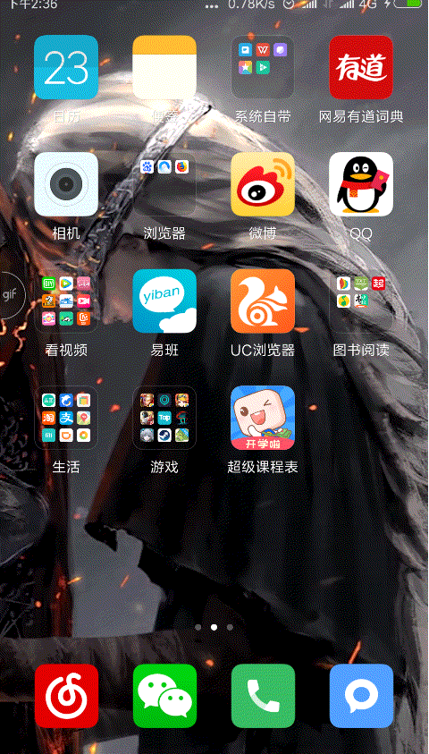

# Assignment 001
student: Hugo(刘雨果)

       Student Number: 20151631

- ## adding the new icon to the application
### 1.choose this

### 2.then this

### finished

- ## adding the blue background
### 1.create a new file called "circle.xml" in drawable
```
<?xml version="1.0" encoding="UTF-8"?>
<shape
    xmlns:android="http://schemas.android.com/apk/res/android"
    android:shape="oval"
    android:useLevel="false" >
    <solid android:color="@android:color/holo_blue_bright" />
    <padding
        android:left="2dp"
        android:top="1dp"
        android:right="2dp"
        android:bottom="1dp" />
    <solid
        android:color="#5CACEE" />
    <stroke
        android:width="1dp"
        android:color="#5CACEE" />
    <size android:width="25dp"
        android:height="25dp" />
</shape>
```
### 2. use the "circle.xml" in "acvitity_main.xml"
```
<TextView
                android:layout_width="50dp"
                android:layout_height="50dp"
                android:gravity="center"
                android:text="mon"
                android:textStyle="bold"
                android:textAllCaps="true"
                android:textColor="#000000"
                android:background="@drawable/circle"/>
```
### finished

- ## adding the refresh button
### 1.create a new file called "refresh_button.xml" in drawable
```
<?xml version="1.0" encoding="UTF-8"?>
<shape
    xmlns:android="http://schemas.android.com/apk/res/android"
    android:shape="oval"
    android:useLevel="false" >
    <padding
        android:left="2dp"
        android:top="1dp"
        android:right="2dp"
        android:bottom="1dp" />
    <stroke
        android:width="5dp"
        android:color="#FFFFFF" />
    <size android:width="25dp"
        android:height="25dp" />
</shape>
```
### 2.add a piece of code in "acvitity_main.xml"
```
<Button
                    android:id="@+id/refresh"
                    android:layout_width="20dp"
                    android:layout_height="20dp"
                    android:layout_alignBottom="@+id/temperature_of_the_day"
                    android:layout_alignParentLeft="true"
                    android:layout_alignParentStart="true"
                    android:layout_marginBottom="39dp"
                    android:layout_marginLeft="22dp"
                    android:layout_marginStart="22dp"
                    android:background="@drawable/refresh_button"
                    android:gravity="right"
                    android:textSize="100sp"
                    android:textStyle="bold" />
```
### finished

- ## when the refresh button is pressed, the temperature, the date and the day of the week are all updated.
### 1.add a piece of code in "MainActivity.java" and replace onCreate()
```
//获取时间日期  get the date
    private static String mWay;
    private static String mYear;
    private static String mMonth;
    private static String mDay;

    @Override
    protected void onCreate(Bundle savedInstanceState) {
        super.onCreate(savedInstanceState);
        setContentView(R.layout.activity_main);

        Button refresh_but = (Button) findViewById(R.id.refresh);
        final TextView xingqi = (TextView) findViewById(R.id.xingqi);
        final TextView myDate = (TextView) findViewById(R.id.tv_date);
        final TextView myCity = (TextView) findViewById(R.id.tv_location);
        final TextView wendu = (TextView) findViewById(R.id.temperature_of_the_day);
        refresh_but.setOnClickListener(new View.OnClickListener() {
            @Override
            public void onClick(View v) {
                final Calendar c = Calendar.getInstance();
                c.setTimeZone(TimeZone.getTimeZone("GMT+8:00"));
                mYear = String.valueOf(c.get(Calendar.YEAR));                 // 获取当前年份     year
                mMonth = String.valueOf(c.get(Calendar.MONTH) + 1);           // 获取当前月份     month
                mDay = String.valueOf(c.get(Calendar.DAY_OF_MONTH));          // 获取当前月份的日期号码      day
                mWay = String.valueOf(c.get(Calendar.DAY_OF_WEEK));
                if("1".equals(mWay)){
                    xingqi.setText("SUNDAY");
                }else if("2".equals(mWay)){
                    xingqi.setText("MONDAY");
                }else if("3".equals(mWay)){
                    xingqi.setText("TUESDAY");
                }else if("4".equals(mWay)){
                    xingqi.setText("WENDNESDAY");
                }else if("5".equals(mWay)){
                    xingqi.setText("THURSDAY");
                }else if("6".equals(mWay)){
                    xingqi.setText("FRIDAY");
                }else if("7".equals(mWay)){
                    xingqi.setText("SATURDAY");
                }
                myDate.setText(mMonth+"/"+mDay+"/"+mYear);   //03/03/2018
                myCity.setText("重庆");
                new DownloadUpdate().execute();
                //wendu.setText("19");
                Toast.makeText(MainActivity.this, "Update successfully", Toast.LENGTH_SHORT).show();
            }
        });
    }
```
### finished

- ## result
- 
